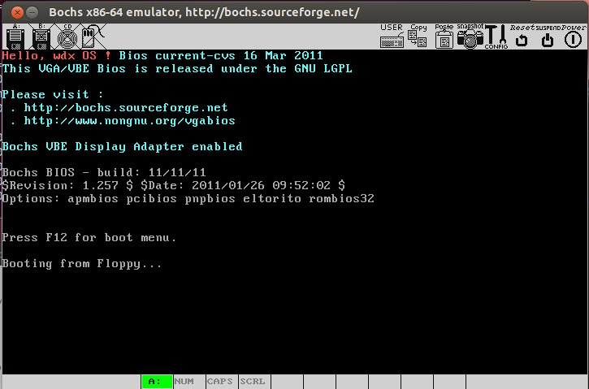

# 一个操作系统的实现

基于《Orange'S: 一个操作系统的实现》，是一些学习和开发时候的笔记。

<!-- MarkdownTOC -->

- 1 最小的“操作系统”
- 2 搭建工作环境
    - 编译安装的方法
    - QEMU
- 3 保护模式(Protect Mode)

<!-- /MarkdownTOC -->

## 1 最小的“操作系统”

代码为 `boot.asm`，需要 NASM 编译，Ubuntu 12.04 x64

    nasm boot.asm -o boot.bin

安装 nasm 比较简单 `sudo apt-get install nasm` 即可，之后使用 Bochs 虚拟机进行测试 `sudo apt-get install vgabios bochs`

刚才完成的只是一个引导扇区(Boot Sector)，但是至少是可以直接在裸机上运行的。

**计算机启动时发生了啥**

+ 加电自检(POST)
+ 寻找启动盘，如果选择从软盘启动，检查软盘的 0 面 0 磁道 1 扇区
+ 如果以 `OxAA55` 结束，则 BIOS 认为它是一个引导扇区(还应包含一段少于 512 字节的执行码)
+ 发现了引导扇区，加载 512 字节到内存地址 `0000:7c00` 处，然后跳转到那里将控制权彻底交给这段引导代码

`$-$$` 表示本行距离开始处的相对距离

## 2 搭建工作环境

安装 bochs，推荐编译安装，但是我编译没成功，就直接 apt-get 大法了，不行到时候再换。先是要创建一个虚拟软盘，用 `bximage` 工具即可。然后把引导扇区写入软盘，用 `dd` 命令：

    sudo apt-get install bximage
    dd if=boot.bin of=a.img bs=512 count=1 conv=notrunc

然后是折腾 bochs 的配置文件，配置好了就可以运行了

    bochs -f bochsrc.txt

可惜不能运行，说有东西没装好，于是继续装

    sudo apt-get install bochs-x

再运行还是不行，再装

    sudo apt-get install bochs-sdl

然后在配置文件中加上

    display_library: sdl

再然后 key mapping 又出问题，把那句注释掉，就至少可以运行了

### 编译安装的方法

安装前准备

    sudo apt-get install build-essential xorg-dev libgtk2.0-dev bison

然后下载源代码，解压缩，配置

    ./configure --prefix=/opt/bochs/debug --enable-plugins --enable-debugger --enable-disasm

    make
    sudo make install

最后加一个符号链接

    sudo ln -s /opt/bochs/debug/bin/bochs /usr/bin/bochsdbg

调试的话就是用 `bochsdbg` 命令，但是好像和 sdl 冲突，运行的时候又需要 sdl 库

### QEMU

另一个虚拟机是 QEMU，结果装了用对应命令不行，暂时 bochs 也能用，不折腾了

## 3 保护模式(Protect Mode)

实模式到保护模式
