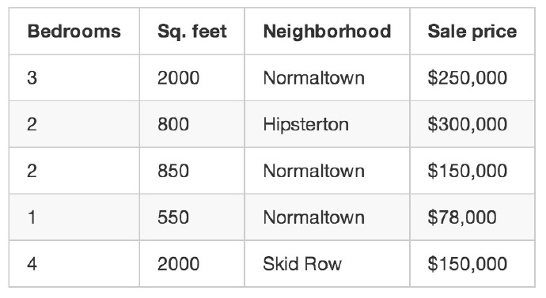
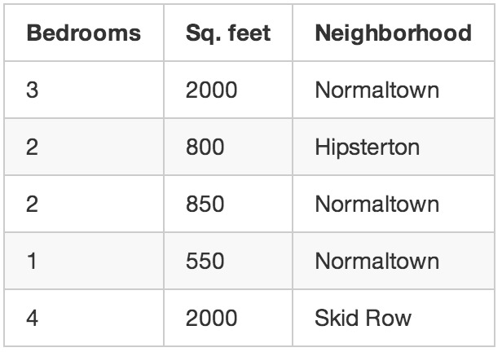
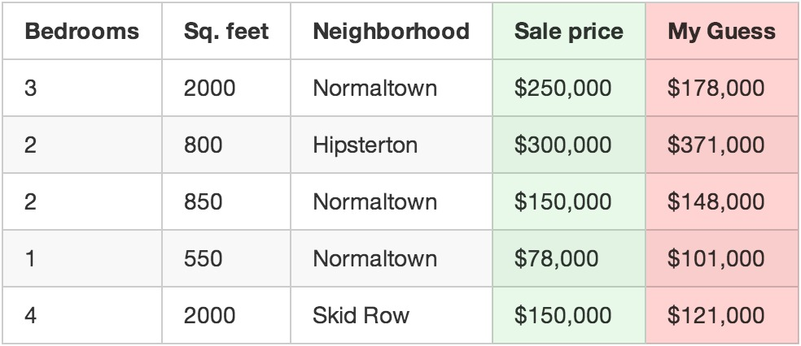
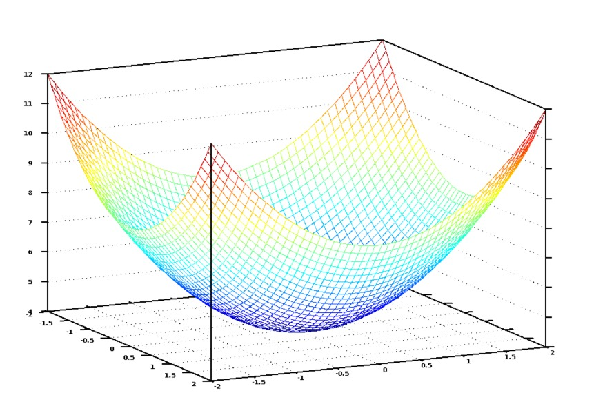
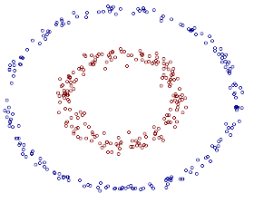

# 机器学习 学习指引

<!-- MarkdownTOC -->

- 最简明入门指南
    - 何为机器学习？
    - 两类机器学习算法
        - 监督式学习
        - 非监督式学习
    - 太酷了，但是评估房价真能被看作“学习”吗？
    - 让我们写代码吧!
        - 步骤 1
        - 步骤2：
        - 步骤3：
        - 思想扰动时间
        - 步骤3中的“尝试每个数字”怎么回事？
    - 还有什么你随便就略过了？
    - 机器学习法力无边吗？
    - 怎样深入学习机器学习
- 机器学习算法基础概念学习总结
    - Logistic回归
    - SVM(Support Vector Machines) 支持向量机：
    - 决策树
    - 朴素贝叶斯
    - K-近邻算法（KNN）
    - 线性回归(Linear Regression)
    - 树回归
    - K-Means(K 均值算法)
    - 算法关联分析
        - Apriori算法：
    - FP-growth算法
- 不大明白的部分

<!-- /MarkdownTOC -->

## 最简明入门指南

在听到人们谈论机器学习的时候，你是不是对它的涵义只有几个模糊的认识呢？你是不是已经厌倦了在和同事交谈时只能一直点头？让我们改变一下吧！

本指南的读者对象是所有对机器学习有求知欲但却不知道如何开头的朋友。我猜很多人已经读过了“机器学习”的维基百科词条，倍感挫折，以为没人能给出一个高层次的解释。本文就是你们想要的东西。

本文目标在于平易近人，这意味着文中有大量的概括。但是谁在乎这些呢？只要能让读者对于ML更感兴趣，任务也就完成了。

### 何为机器学习？

机器学习这个概念认为，对于待解问题，你无需编写任何专门的程序代码，遗传算法（generic algorithms）能够在数据集上为你得出有趣的答案。对于遗传算法，不用编码，而是将数据输入，它将在数据之上建立起它自己的逻辑。

举个例子，有一类算法称为分类算法，它可以将数据划分为不同的组别。一个用来识别手写数字的分类算法，不用修改一行代码，就可以用来将电子邮件分为垃圾邮件和普通邮件。算法没变，但是输入的训练数据变了，因此它得出了不同的分类逻辑。

机器学习算法是个黑盒，可以重用来解决很多不同的分类问题。

“机器学习”是一个涵盖性术语，覆盖了大量类似的遗传算法。

### 两类机器学习算法

你可以认为机器学习算法分为两大类：**监督式学习（Supervised Learning）**和**非监督式学习（Unsupervised Learning）**。两者区别很简单，但却非常重要。

#### 监督式学习

假设你是一名房产经纪，生意越做越大，因此你雇了一批实习生来帮你。但是问题来了——你可以看一眼房子就知道它到底值多少钱，实习生没有经验，不知道如何估价。

为了帮助你的实习生（也许是为了解放你自己去度个假），你决定写个小软件，可以根据房屋大小、地段以及类似房屋的成交价等因素来评估你所在地区房屋的价值。

你把3个月来城里每笔房屋交易都写了下来，每一单你都记录了一长串的细节——卧室数量、房屋大小、地段等等。但最重要的是，你写下了最终的成交价：

这是我们的“训练数据”。

我们要利用这些训练数据来编写一个程序来估算该地区其他房屋的价值：

这就称为监督式学习。你已经知道每一栋房屋的售价，换句话说，你知道问题的答案，并可以反向找出解题的逻辑。

为了编写软件，你将包含每一套房产的训练数据输入你的机器学习算法。算法尝试找出应该使用何种运算来得出价格数字。

这就像是算术练习题，算式中的运算符号都被擦去了：

看了这些题，你能明白这些测验里面是什么样的数学问题吗？你知道，你应该对算式左边的数字“做些什么”以得出算式右边的答案。

在监督式学习中，你是让计算机为你算出数字间的关系。而一旦你知道了解决这类特定问题所需要的数学方法后，你就可以解答同类的其它问题了。

#### 非监督式学习

让我们回到开头那个房地产经纪的例子。要是你不知道每栋房子的售价怎么办？即使你所知道的只是房屋的大小、位置等信息，你也可以搞出很酷的花样。这就是所谓的非监督式学习。

即使你不是想去预测未知的数据（如价格），你也可以运用机器学习完成一些有意思的事。
这就有点像有人给你一张纸，上面列出了很多数字，然后对你说:“我不知道这些数字有什么意义，也许你能从中找出规律或是能将它们分类，或是其它什么-祝你好运！”

你该怎么处理这些数据呢？首先，你可以用个算法自动地从数据中划分出不同的细分市场。也许你会发现大学附近的买房者喜欢户型小但卧室多的房子，而郊区的买房者偏好三卧室的大户型。这些信息可以直接帮助你的营销。

你还可以作件很酷的事，自动找出房价的离群数据，即与其它数据迥异的值。这些鹤立鸡群的房产也许是高楼大厦，而你可以将最优秀的推销员集中在这些地区，因为他们的佣金更高。

本文余下部分我们主要讨论监督式学习，但这并不是因为非监督式学习用处不大或是索然无味。实际上，随着算法改良，不用将数据和正确答案联系在一起，因此非监督式学习正变得越来越重要。

老学究请看:还有很多其它种类的机器学习算法。但初学时这样理解不错了。

### 太酷了，但是评估房价真能被看作“学习”吗？

作为人类的一员，你的大脑可以应付绝大多数情况，并且没有任何明确指令也能够学习如何处理这些情况。如果你做房产经纪时间很长，你对于房产的合适定价、它的最佳营销方式以及哪些客户会感兴趣等等都会有一种本能般的“感觉”。强人工智能（Strong AI）研究的目标就是要能够用计算机复制这种能力。

但是目前的机器学习算法还没有那么好——它们只能专注于非常特定的、有限的问题。也许在这种情况下，“学习”更贴切的定义是“在少量范例数据的基础上找出一个等式来解决特定的问题”。

不幸的是，“机器在少量范例数据的基础上找出一个等式来解决特定的问题”这个名字太烂了。所以最后我们用“机器学习”取而代之。

当然，要是你是在50年之后来读这篇文章，那时我们已经得出了强人工智能算法，而本文看起来就像个老古董。未来的人类，你还是别读了，叫你的机器仆人给你做份三明治吧。

### 让我们写代码吧!

前面例子中评估房价的程序，你打算怎么写呢？往下看之前，先思考一下吧。

如果你对机器学习一无所知，很有可能你会尝试写出一些基本规则来评估房价，如下：

    def estimate_house_sales_price(num_of_bedrooms, sqft, neighborhood):
      price = 0

      # In my area, the average house costs $200 per sqft
      price_per_sqft = 200

      if neighborhood == "hipsterton":
        # but some areas cost a bit more
        price_per_sqft = 400

      elif neighborhood == "skid row":
        # and some areas cost less
        price_per_sqft = 100

      # start with a base price estimate based on how big the place is
      price = price_per_sqft * sqft

      # now adjust our estimate based on the number of bedrooms
      if num_of_bedrooms == 0:
        # Studio apartments are cheap
        price = price — 20000
      else:
        # places with more bedrooms are usually
        # more valuable
        price = price + (num_of_bedrooms * 1000)

     return price

假如你像这样瞎忙几个小时，也许会取得一点成效，但是你的程序永不会完美，而且当价格变化时很难维护。

如果能让计算机找出实现上述函数功能的办法，这样岂不更好？只要返回的房价数字正确，谁会在乎函数具体干了些什么呢？

    def estimate_house_sales_price(num_of_bedrooms, sqft, neighborhood):
      price = <computer, plz do some math for me>

      return price

考虑这个问题的一种角度是将房价看做一碗美味的汤，而汤中成分就是卧室数、面积和地段。如果你能算出每种成分对最终的价格有多大影响，也许就能得到各种成分混合起来形成最终价格的具体比例。

这样可以将你最初的程序（全是疯狂的if else语句）简化成类似如下的样子：

    def estimate_house_sales_price(num_of_bedrooms, sqft, neighborhood):
     price = 0

     # a little pinch of this
     price += num_of_bedrooms * .841231951398213

     # and a big pinch of that
     price += sqft * 1231.1231231

     # maybe a handful of this
     price += neighborhood * 2.3242341421

     # and finally, just a little extra salt for good measure
     price += 201.23432095

     return price

请注意那些用粗体标注的神奇数字——.841231951398213, 1231.1231231,2.3242341421, 和201.23432095。它们称为权重。如果我们能找出对每栋房子都适用的完美权重，我们的函数就能预测所有的房价！

找出最佳权重的一种笨办法如下所示：

#### 步骤 1

首先，将每个权重都设为1.0：

    def estimate_house_sales_price(num_of_bedrooms, sqft, neighborhood):
      price = 0

      # a little pinch of this
      price += num_of_bedrooms * 1.0

      # and a big pinch of that
      price += sqft * 1.0

      # maybe a handful of this
      price += neighborhood * 1.0

      # and finally, just a little extra salt for good measure
      price += 1.0

      return price

#### 步骤2：

将每栋房产带入你的函数运算，检验估算值与正确价格的偏离程度：

例如：上表中第一套房产实际成交价为25万美元，你的函数估价为17.8万，这一套房产你就差了7.2万。

再将你的数据集中的每套房产估价偏离值平方后求和。假设数据集中有500套房产交易，估价偏离值平方求和总计为86,123,373美元。这就反映了你的函数现在的“正确”程度。

现在，将总计值除以500，得到每套房产的估价偏离平均值。将这个平均误差值称为你函数的代价。

如果你能调整权重使得这个代价变为0，你的函数就完美了。它意味着，根据输入的数据，你的程序对每一笔房产交易的估价都是分毫不差。而这就是我们的目标——尝试不同的权重值以使代价尽可能的低。

#### 步骤3：

不断重复步骤2，尝试所有可能的权重值组合。哪一个组合使得代价最接近于0，它就是你要使用的，你只要找到了这样的组合，问题就得到了解决!

#### 思想扰动时间

这太简单了，对吧？想一想刚才你做了些什么。你取得了一些数据，将它们输入至三个通用的简单步骤中，最后你得到了一个可以对你所在区域的房屋进行估价的函数。房价网，要当心咯！
但是下面的事实可能会扰乱你的思想：

1. 过去40年来，很多领域（如语言学/翻译学）的研究表明，这种通用的“搅动数据汤”（我编造的词）式的学习算法已经胜过了需要利用真人明确规则的方法。机器学习的“笨”办法最终打败了人类专家。
2. 你最后写出的函数真是笨，它甚至不知道什么是“面积”和“卧室数”。它知道的只是搅动，改变数字来得到正确的答案。
3. 很可能你都不知道为何一组特殊的权重值能起效。所以你只是写出了一个你实际上并不理解却能证明的函数。
4. 试想一下，你的程序里没有类似“面积”和“卧室数”这样的参数，而是接受了一组数字。假设每个数字代表了你车顶安装的摄像头捕捉的画面中的一个像素，再将预测的输出不称为“价格”而是叫做“方向盘转动度数”，这样你就得到了一个程序可以自动操纵你的汽车了！

太疯狂了，对吧？

#### 步骤3中的“尝试每个数字”怎么回事？

好吧，当然你不可能尝试所有可能的权重值来找到效果最好的组合。那可真要花很长时间，因为要尝试的数字可能无穷无尽。

为避免这种情况，数学家们找到了很多聪明的办法来快速找到优秀的权重值，而不需要尝试过多。下面是其中一种：

首先，写出一个简单的等式表示前述步骤2：

这是你的代价函数。

接着，让我们将这同一个等式用机器学习的数学术语（现在你可以忽略它们）进行重写：

θ表示当前的权重值。 J(θ) 意为“当前权重值对应的代价”。

这个等式表示我们的估价程序在当前权重值下偏离程度的大小。如果将所有赋给卧室数和面积的可能权重值以图形形式显示，我们会得到类似下图的图表：

代价函数的图形像一支碗。纵轴表示代价。

图中蓝色的最低点就是代价最低的地方——即我们的程序偏离最小。最高点意味着偏离最大。所以，如果我们能找到一组权重值带领我们到达图中的最低点，我们就找到了答案！

因此，我们只需要调整权重值使我们在图上能向着最低点“走下坡路”。如果对于权重的细小调节能一直使我们保持向最低点移动，那么最终我们不用尝试太多权重值就能到达那里。

如果你还记得一点微积分的话，你也许记得如果你对一个函数求导，结果会告诉你函数在任一点的斜率。换句话说，对于图上给定一点，它告诉我们那条路是下坡路。我们可以利用这一点朝底部进发。

所以，如果我们对代价函数关于每一个权重求偏导，那么我们就可以从每一个权重中减去该值。这样可以让我们更加接近山底。一直这样做，最终我们将到达底部，得到权重的最优值。（读不懂？不用担心，接着往下读）。

这种找出最佳权重的办法被称为批量梯度下降，上面是对它的高度概括。如果想搞懂细节，不要害怕，继续深入下去吧。

当你使用机器学习算法库来解决实际问题，所有这些都已经为你准备好了。但明白一些具体细节总是有用的。

### 还有什么你随便就略过了？

上面我描述的三步算法被称为多元线性回归。你估算等式是在求一条能够拟合所有房价数据点的直线。然后，你再根据房价在你的直线上可能出现的位置用这个等式来估算从未见过的房屋的价格。这个想法威力强大，可以用它来解决“实际”问题。

但是，我为你展示的这种方法可能在简单的情况下有效，它不会在所有情况下都有用。原因之一是因为房价不会一直那么简单地跟随一条连续直线。

但是，幸运的是，有很多办法来处理这种情况。对于非线性数据，很多其他类型的机器学习算法可以处理（如神经网络或有核向量机）。还有很多方法运用线性回归更灵活，想到了用更复杂的线条来拟合。在所有的情况中，寻找最优权重值这一基本思路依然适用。

还有，我忽略了过拟合的概念。很容易碰上这样一组权重值，它们对于你原始数据集中的房价都能完美预测，但对于原始数据集之外的任何新房屋都预测不准。这种情况的解决之道也有不少（如正则化以及使用交叉验证数据集）。学会如何处理这一问题对于顺利应用机器学习至关重要。

换言之，基本概念非常简单，要想运用机器学习得到有用的结果还需要一些技巧和经验。但是，这是每个开发者都能学会的技巧。

### 机器学习法力无边吗？

一旦你开始明白机器学习技术很容易应用于解决貌似很困难的问题（如手写识别），你心中会有一种感觉，只要有足够的数据，你就能够用机器学习解决任何问题。只需要将数据输入进去，就能看到计算机变戏法一样找出拟合数据的等式。

但是很重要的一点你要记住，机器学习只能对用你占有的数据实际可解的问题才适用。

例如，如果你建立了一个模型来根据每套房屋内盆栽数量来预测房价，它就永远不会成功。房屋内盆栽数量和房价之间没有任何的关系。所以，无论它怎么去尝试，计算机也推导不出两者之间的关系。

你只能对实际存在的关系建模。

### 怎样深入学习机器学习

我认为，当前机器学习的最大问题是它主要活跃于学术界和商业研究组织中。对于圈外想要有个大体了解而不是想成为专家的人们，简单易懂的学习资料不多。但是这一情况每一天都在改善。

吴恩达教授（Andrew Ng）在Coursera上的机器学习免费课程非常不错。我强烈建议由此入门。任何拥有计算机科学学位、还能记住一点点数学的人应该都能理解。

另外，你还可以下载安装SciKit-Learn，用它来试验成千上万的机器学习算法。它是一个python框架，对于所有的标准算法都有“黑盒”版本。

## 机器学习算法基础概念学习总结

(1) 10折交叉验证：英文名是10-fold cross-validation，用来测试算法的准确性。是常用的测试方法。将数据集分成10份。轮流将其中的9份作为训练数据，1分作为测试数据，进行试验。每次试验都会得出相应的正确率（或差错率）。10次的结果的正确率（或差错率）的平均值作为对算法精度的估计，一般还需要进行多次10折交叉验证，在求其平均值，对算法的准确性进行估计。

(2) 极大似然估计：极大似然估计，只是一种概率论在统计学中的应用，它是参数评估的方法之一。说的 已知某个随机样本满足某种概率分布，但是其中具体的参数不清楚，参数估计通过若干次实验，观察其结果，利用结果推出参数的大概值。极大似然估计是建立在这样的思想上的：已知某个参数能使这个样本出现的概率最大。我们当然不会再去选择其他其他小概率的样本，所以干脆就把这个参数作为估计的真实值。

(3) 在信息论中，熵表示的是不确定性的量度。信息论的创始人香农在其著作《通信的数学理论》中提出了建立在概率统计模型上的信息度量。他把信息定义为”用来消除不确定性的东西“。熵的定义为信息的期望值。

ps:熵指的是体系的混乱程度，它在控制论，概率论，数论，天体物理，生命科学等领域都有重要的应用，在不同的学科中也有引申出更为具体的定义，是各个领域十分重要的参量。熵由鲁道夫.克劳修斯提出，并应用在热力学中。后来在，克劳德.埃尔伍德.香农 第一次将熵的概念引入到信息论中来。

(4) 后验概率是信息论的基本概念之一。在一个通信系统中，在收到某个消息之后，接收端所了解到的该消息发送的概率称为后验证概率。后验概率是指在得到”结果“的信息后重新修正的概率，如贝叶斯公式中的。是执果寻因的问题。后验概率和先验概率有着不可分割的联系，后验的计算要以先验概率为基础，其实说白了后验概率其实就是条件概率。

(5) PCA 主成分分析:
优点：降低数据的复杂性，识别最重要的多个特征。
缺点：不一定需要，且可能损失有用信息。
适用适用类型：数值型数据。
技术类型：降维技术。

简述：在PCA中，数据从原来的坐标系转换到了新的坐标系，新坐标系的选择是由数据本身决定的。第一个新坐标轴选择时原始数据中方差最大的方向，第二个新坐标轴的选择和第一个坐标轴正交且具有最大方差的方向。该过程一直重复，重复次数为原始数据中特征的数目。会发现大部分方差都包含在最前面的几个新坐标轴中。因此，可以忽略余下的坐标轴，即对数据进行了降维处理。除了PCA主成分分析技术，其他降维技术还有ICA(独立成分分析)，因子分析等。

(6) 将不同的分类器组合起来，而这种组合结果则被称为集成方法（ensemble method）或者元算法（meta-algorithm）。

(7) 回归算法和分类算法很像，不过回归算法和分类算法输出标称型类别值不同的是，回归方法会预测出一个连续的值，即回归会预测出具体的数据，而分类只能预测类别。

(8) SVD(singular value decomposition) 奇异值分解:

+ 优点：简化数据，去除噪声，提高算法的结果。
+ 缺点：数据转换可能难以理解。
+ 适用数据类型：数值型数据。
+ ps:SVD是矩阵分解的一种类型。

总结：SVD是一种强大的降维工具，我们可以利用SVD来逼近矩阵并从中提取重要特征。通过保留矩阵80%~90%的能量，就可以得到重要的特征并去掉噪声。SVD已经运用到多个应用中，其中一个成功的应用案例就是推荐引擎。推荐引擎将物品推荐给用户，协同过滤则是一种基于用户喜好和行为数据的推荐和实现方法。协同过滤的核心是相似度计算方法，有很多相似度计算方法都可以用于计算物品或用户之间的相似度。通过在低维空间下计算相似度，SVD提高了推荐引擎的效果。

(9)共线性：是指线性回归模型中的解释变量之间由于存在精确的相关关系或高度相关关系而使模型估计失真或难以估计。

### Logistic回归

+ 优点：计算代价不高，易于理解和实现。
+ 缺点：容易欠拟合，分类精度可能不高。
+ 适用数据类型：数值型和标称型数据。
+ 类别：分类算法。
+ 适用场景：解决二分类问题。

简述：Logistic回归算法基于Sigmoid函数，或者说Sigmoid就是逻辑回归函数。Sigmoid函数定义如下：1/（1+exp（-z))。函数值域范围(0,1)。可以用来做分类器。
Sigmoid函数的函数曲线如下：

逻辑回归模型分解如下：

(1)首先将不同维度的属性值和对应的一组权重加和，公式如下： z = w0+w1x1+w2x2+…+wm*xm。（其中x1,x2,…,xm是某样本数据的各个特征，维度为m）

ps：这里就是一个线性回归。W权重值就是需要经过训练学习到的数值，具体W向量的求解，就需要用到极大似然估计和将似然估计函数代入到 优化算法来求解。最常用的最后化算法有 梯度上升算法。

由上面可见：逻辑回归函数虽然是一个非线性的函数，但其实其去除Sigmoid映射函数之后，其他步骤都和线性回归一致。

(2)然后将上述的线性目标函数 z 代入到sigmond逻辑回归函数，可以得到值域为（0,0.5)和（0.5,1）两类值，等于0.5的怎么处理还以自己定。这样其实就得到了2类数据，也就体现了二分类的概念。

总结：Logistic回归的目的是寻找一个非线性函数Sigmoid的最佳拟合参数，参数的求解过程可以由最优化算法来完成。在最优化算法中，最常用的就是梯度上升算法，而梯度上升算法有可以简化为随机梯度上升算法。

### SVM(Support Vector Machines) 支持向量机：

+ 优点：泛化错误率低，计算开销不大，结果易解释。
+ 缺点：对参数调节和核函数的选择敏感，原始分类器不加修改仅适用于处理二分类问题。
+ 适用数据类型：数值型和标称型数据。
+ 类别：分类算法。
+ 适用场景：解决二分类问题。

简述：通俗的讲，SVM是一种二类分类模型，其基本模型定义为特征空间上的间隔最大的线性分类器，即支持向量机的学习策略便是间隔最大化，最终可转化为一个凸二次规划问题的求解。或者简单的可以理解为就是在高维空间中寻找一个合理的超平面将数据点分隔开来，其中涉及到非线性数据到高维的映射以达到数据线性可分的目的。

支持向量概念：

上面样本图是一个特殊的二维情况，真实情况当然可能是很多维。先从低纬度简单理解一下什么是支持向量。从图中可以看到3条线，中间那条红色的线到其他两条线的距离相等。这条红色的就是SVM在二维情况下要寻找的超平面，用于二分类数据。而支撑另外两条线上的点就是所谓的支持向量。从图中可以看到，中间的超平面和另外两条线中间是没有样本的。找到这个超平面后，利用超平面的数据数学表示来对样本数据进行二分类，就是SVM的机制了。

ps：《机器学习实战》书中有这么几个概念：

1. 如果能找到一个直线（或多维的面）将样本点分开，那么这组数据就是线性可分的。将上述数据集分隔开来的直线(或多维的面)称为分隔超平面。分布在超平面一侧的数据属于一个类别，分布在超平面另一侧的数据属于另一个类别
2. 支持向量（Support vector）就是分离超平面最近的那些点。
3. 几乎所有分类问题都可以使用SVM，值得一提的是，SVM本身是一个二分类分类器，对多类问题应用SVM需要对代码做一些修改。

公式：SVM有很多实现，但是本章值关注其中最流行的一种实现，及序列最小优化（Sequential Minimal Optimization，SMO）算法。其公式如下：

SMO算法的目标是求出一些列的alpha，一旦求出了alpha，就很容易计算出权重向量w并得到分隔超平面。

SMO算法的工作原理是：每次循环中选择两个alpha进行优化处理。一旦找到一对合适的alpha，那么就增大其中一个同时减小另一个。这里所谓的“合适”就是指两个alpha必须符合一定的条件，条件之一就是这两个alpha必须要在间隔边界之外，而其第二个条件则是这两个alpha还没有进行过区间化处理或者不在边界上。

核函数将数据从低维度映射到高维：SVM是通过寻找超平面将数据进行分类的，但是当数据不是线性可分的时候就需要利用核函数将数据从低维映射到高维使其线性可分后，在应用SVM理论。

这个二维数据分布不是线性可分的，其方程为：

但是通过核函数维度映射后，其变为：

对应的方程为：

这样映射后的数据就变成了线性可分的，就可以应用SVM理论了。

总结：支持向量机是一种分类器。之所以成为“机”是因为他会产生一个二值决策结果，即它是一种‘决策’机。核方法或者说核技巧会将数据（有时是非线性数据）从一个低维空间映射到一个高维空间，可以将一个在低维空间中的非线性问题转换为高维空间下的线性问题来求解。

### 决策树

+ 优点：计算复杂度不高，输出结果易于理解，对中间值的缺失不敏感，可以处理不相关特征数据。
+ 缺点：可能会产生匹配过度问题。
+ 适用数据类型：数值型和标称型。
+ 算法类型：分类算法。
+ 数据要求：树的构造只适用于标称型的数据，因此数值型数据必须离散化。

简述：在构造决策树时，我们需要解决的第一个问题就是，当前数据集上哪个特征在划分数据分类时起决定性作用。为了找到决定性特征，划分出最好的结果，我们必须评估每个特征。完成测试后，原始数据就被划分为几个数据子集。这些数据的子集分布在第一个决策点的所有分支上，如果某个分支下的数据属于同一个类型，则无需进一步对数据集进行切割。反之则需要进一步切割。

创建分支的伪代码如下：

    检测数据集中的每个子项是否属于同一分类：
       if so return 类标签；
       else
           寻找数据集的最好特征
           划分数据集
           创建分支结点
               for 每个划分的子集
                   调用函数createBranch并增加返回结果到分支结点中
               return 分支结点

在可以评测哪种数据划分方式是最好的数据划分之前，我们必须学习如何计算信息增益。集合的信息度量方式称为香农熵或者简称为熵。熵在信息论中定义为信息的期望值。

信息熵的计算公式为：

H(信息熵) = -∑ P（xi） log2P（xi） ps:其中p（xi）表示选择该分类的概率。

下面简述一下生成决策树的步骤：

1. 根据给定的训练数据，根据熵最大原则根据每一个维度来划分数据集，找到最关键的维度。
2. 当某个分支下所有的数据都数据同一分类则终止划分并返回类标签，否则在此分支上重复实施(1)过程。
3. 依次计算就将类标签构建成了一棵抉择树。
4. 依靠训练数据构造了决策树之后，我们就可以将它用于实际数据的分类。

ps:当然生成决策树的算法不止这一个，还有其他一些生成决策树的方法，比如：C4.5和CART。

总结：决策树分类器就像带有终止块的流程图，终止块表示分类结果。开始处理数据集时，我们首先需要测量集合中数据的不一致性，也就是熵，然后寻找最优的方案划分数据集，直到数据集中的所有数据属于同一个分类。

### 朴素贝叶斯

+ 优点：在数据较少的情况下仍然有效，可以处理多类别问题。
+ 缺点：对于输入数据的准备方式较为敏感。
+ 适用的数据类型：标称型数据。
+ 算法类型：分类算法

简述：朴素贝叶斯是贝叶斯理论的一部分，贝叶斯决策理论的核心思想，即选择具有高概率的决策。朴素贝叶斯之所以冠以朴素开头，是因为其在贝叶斯理论的基础上做出了两点假设：

1. 每个特征之间相互独立。
2. 每个特征同等重要。

贝叶斯准则是构建在条件概率的基础之上的，其公式如下：

P（H|X）=P（X|H)P（H)/P(X)

ps：P（H|X）是根据X参数值判断其属于类别H的概率，称为后验概率。P（H)是直接判断某个样本属于H的概率，称为先验概率。P（X|H)是在类别H中观测到X的概率（后验概率），P(X)是在数据库中观测到X的概率。可见贝叶斯准则是基于条件概率并且和观测到样本的先验概率和后验概率是分不开的。

总结：对于分类而言，使用概率有事要比使用硬规则更为有效。贝叶斯概率及贝叶斯准则提供了一种利用已知值来估计未知概率的有效方法。可以通过特征之间的条件独立性假设，降低对数据量的需求。尽管条件独立性的假设并不正确，但是朴素贝叶斯仍然是一种有效的分类器。

### K-近邻算法（KNN）

+ 优点：精度高、对异常值不敏感、无数据输入假定。
+ 缺点：计算复杂度高，空间复杂度搞。
+ 适用数据范围：数值型和标称型。
+ 算法类型：分类算法。

简述：算法原理，存在一个样本数据集合，也称作训练样本集，并且样本集中每个数据都存在标签，即我们知道样本集中每一个数据与所属分类的对应关系。输入没有标签的新数据后，将新数据的每个特征和样本集中数据对应的特征进行比较，然后算法提取样本集中特征最相似数据（最近邻）的分类标签。一般来说，我们只选择样本数据集中前k个最相似的数据，这就是k-近邻算法中k的出处，通常k是不大于20的整数。最后选择k个最相似数据中出现次数最多的分类，作为新数据的分类。

### 线性回归(Linear Regression)

+ 优点：结果易于理解，计算上不复杂。
+ 缺点：对非线性数据拟合不好。
+ 适用数据类型：数值型和标称型数据。
+ 算法类型：回归算法。

ps:回归于分类的不同，就在于其目标变量时连续数值型。

简述：在统计学中，线性回归（Linear Regression）是利用称为线性回归方程的最小平方函数对一个或多个自变量和因变量之间关系进行建模的一种回归分析。这种函数是一个或多个称为回归系数的模型参数的线性组合（自变量都是一次方）。只有一个自变量的情况称为简单回归，大于一个自变量情况的叫做多元回归。

线性方程的模型函数的向量表示形式为：

通过训练数据集寻找向量系数的最优解，即为求解模型参数。其中求解模型系数的优化器方法可以用“最小二乘法”、“梯度下降”算法，来求解损失函数的最优解：

附加：岭回归（ridge regression）

岭回归是一种专用于共线性数据分析的有偏估计回归方法，实质上是一种改良的最小二乘估计法，通过放弃最小二乘法的无偏性，以损失部分信息、降低精度为代价，获得回归系数更为符合实际、更可靠的回归方法，对病态数据的耐受性远远强于最小二乘法。

岭回归分析法是从根本上消除复共线性影响的统计方法。岭回归模型通过在相关矩阵中引入一个很小的岭参数K（1>K>0），并将它加到主对角线元素上，从而降低参数的最小二乘估计中复共线特征向量的影响，减小复共线变量系数最小二乘估计的方法，以保证参数估计更接近真实情况。岭回归分析将所有的变量引入模型中，比逐步回归分析提供更多的信息。

总结：与分类一样，回归也是预测目标值的过程。回归与分类的不同点在于，前者预测连续型的变量，而后者预测离散型的变量。回归是统计学中最有力的工具之一。在回归方程里，求得特征对应的最佳回归系统的方法是最小化误差的平方和。

### 树回归

+ 优点：可以对复杂和非线性的数据建模。
+ 缺点：结果不易理解。
+ 适用数据类型：数值型和标称型数据。
+ 算法类型：回归算法。

简述：线性回归方法可以有效的拟合所有样本点(局部加权线性回归除外）。当数据拥有众多特征并且特征之间关系十分复杂时，构建全局模型的回归算法是比较困难的。此外，实际中很多问题为非线性的，例如常见的分段函数，不可能用全局线性模型类进行拟合。树回归将数据集切分成多份易建模的数据，然后利用线性回归进行建模和拟合。较为经典的树回归算法为CART（classification and regreesion trees 分类回归树）。

### K-Means(K 均值算法)

+ 优点：容易实现。
+ 缺点：可能收敛到局部最小值，在大规模数据集上收敛较慢。
+ 适用数据类型：数值型数据。
+ 算法类型：聚类算法。

ps:K-Means和上面的分类和回归算法不同，它属于非监督学习算法。类似分类和回归中的目标变量事先并不存在。与前面“对于数据变量X能预测变量Y”不同的是，非监督学习算法要回答的问题是：“从数据X中能发现什么？“，这里需要回答的X方面可能的问题是：”构成X的最佳6个数据簇都是哪些“或者”X中哪三个特征最频繁共现？“。

K-Means的基本步骤：

1. 从数据对象中随机的初始化K个初始点作为质心。然后将数据集中的每个点分配到一个簇中，具体来讲每个点找到距其最近的质心，并将其分配给该质心所对应的簇。
2. 计算每个簇中样本点的均值，然后用均值更新掉该簇的质心。然后划分簇结点。
3. 迭代重复（2）过程，当簇对象不再发生变化时，或者误差在评测函数预估的范围时，停止迭代。

算法的时间复杂度上界为O(nkt), 其中t是迭代次数。

ps:初始的K个质心的选取以及距离计算公式的好坏，将影响到算法的整体性能。
附加：

二分K-均值算法:为克服K-均值算法收敛于局部最小值的问题，有人提出了另一个称为二分K-均值（bisecting K-Means）的算法。该算法首先将所有点作为一个簇，然后将簇一分为二。之后选择其中一个簇继续划分，选择哪个一簇进行划分取决于对其划分是否可以最大程度降低SSE(Sum of Squared Error，两个簇的总误差平方和)的值。

### 算法关联分析

首先了解两个概念：

+ 频繁项集（frequent item sets）:经常出现在一块的物品的集合。
+ 关联规则（association rules）：暗示两种物品间可能存在很强的关系。
+ 项集的支持度（support）：数据集中包含该项集记录所占的比例。
+ 关联分析的目标包括两项：发现频繁项集合发现关联规则。首先找到频繁项集，然后才能获得关联规则。

#### Apriori算法：

+ 优点：易编码实现。
+ 缺点：在大型数据集上可能较慢。
+ 适用数据类型：数值型或标称型数据。
+ 原理：如果某个项集时频繁的，那么他的所有子集也是频繁的。

Apriori运用的DEMO示例参见博客：http://blog.csdn.net/lantian0802/article/details/38331463

简述：Apriori算法是发现频繁项集的一种方法。Apriori算法的两个输入参数分别是最小支持度和数据集。该算法首先会生成所有单个item的项集列表。然后扫描列表计算每个item的项集支持度，将低于最小支持度的item排除掉，然后将每个item两两组合，然后重新计算整合后的item列表的支持度并且和最小支持度比较。重复这一过程，直至所有项集都被去掉。

总结：关联分析是用于发现大数据集中元素间有趣关系的一个工具集，可以采用两种方式来量化这些有趣的关系。发现元素间不同的组合是个十分耗时的任务，不可避免需要大量昂贵的计算资源，这就需要一些更智能的方法在合理的时间范围内找到频繁项集。能够实现这一目标的一个方法是Apriori算法，它使用Apriori原理来减少在数据库上进行检查的集合的数目。Apriori原理是说如果一个元素是不频繁的，那么那些包含该元素的超集也是不频繁的。Apriori算法从单元素项集开始，通过组合满足最小支持度要求的项集来形成更大的集合。支持度用来度量一个集合在原始数据中出现的频率。

### FP-growth算法

简述：FP-growth也是用于发现频繁项集的算法，他以FP树的结构存储构建元素，其他Apriori算法的性能要好很多。通常性能要好2个数量级以上。其发现频繁项集的过程如下：(1)构建FP树。(2)从FP树中挖掘频繁项集。

+ 优点：一般要快于Apriori。
+ 缺点：实现比较困难，在某些数据集上性能会下降。
+ 适用数据类型：标称型数据。

总结：FP-growth算法是一种用于发现数据集中频繁模式的有效方法。FP-growth算法利用Apriori原则，执行更快。Apriori算法产生候选项集，然后扫描数据集来检查他们是否频繁。由于只对数据集扫描两次，因此FP-growth算法执行更快。在FP-growth算法中，数据集存储在一个称为FP树的结构中。FP树构建完成后，可以通过查找元素项的条件及FP树来发现频繁项集。该过程不断以更多元素作为条件重复进行，直到FP树只包含一个元素为止。

## 不大明白的部分

+ SVM
+ AdaBoost

只要学习机器学习，一定会看的书籍我推荐一下:

+ Mitchell 的《机器学习》。Mitchell是机器学习的鼻祖，第一个提出机器学习概念的人。这本书很薄，很简单。内容很陈旧，但是都是机器学习的经典问题。而且，这本书概念清晰正确(很可贵啊，又简单又正确的书，说明作者功力很强)。
+ Simon Haykin的《神经网络与机器学习》。 事实上，现在常见的很多机器学习算法都发端于神经网络，像SVM，深度学习，CNN等等。这本书详细的介绍了神经网络及其相关算法的所有细节。如果想深入了解的话，可以看一下。只想运用的话，也可以随便翻翻算法的介绍。
+ AIMA，《人工智能：一种现代的方法》。基本上学术界的人们都认为机器学习是人工智能学科的下属分支(另一部分人认为是统计学或者数学的分支)，所以，一本人工智能的书也是学习机器学习可以参考的方面。

