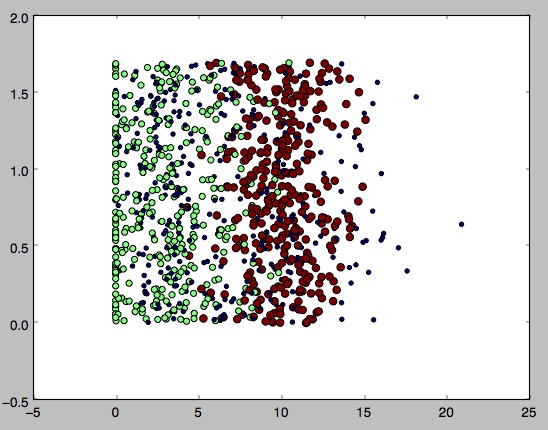

# 机器学习实战

<!-- MarkdownTOC -->

- 第一部分 分类
- 第 1 章 机器学习基础
    - 如何选择合适的算法
    - 开发机器学习应用程序的步骤
- 第 2 章 k-近邻算法(kNN)
    - k-近邻算法的一般流程
    - 使用k-近邻算法改进约会网站的配对效果
        - 使用 Matplotlib 创建散点图
        - 归一化数值
        - 测试算法
    - 小结
- 决策树

<!-- /MarkdownTOC -->

## 第一部分 分类

本书前两部分主要谈好监督学习(supervised learning)。在监督学习过程中，我们只需要给定输入样本集，机器就可以 从中推演出指定目标变量的可能结果。监督学习相对比较简单，机器只需从输入数据中预测合适的模型，并从中计算出目标变量的结果。

监督学习一般使用两种类型的目标变量：标称型和数值型。标称型目标变量的结果只在有限目标集中取值，如真与假。数值型目标变量主要用于回归分析。

## 第 1 章 机器学习基础

机器学习：利用计算机来彰显数据背后的真实含义。

简单地说，机器学习就是把无序的数据转换成有用的信息。

机器学习的主要任务就是**分类**。最终我们决定使用某个机器学习算法进行分类，首先需要做的是算法训练，即学习如何分类。通常我们为算法输入大量已分类数据作为算法的**训练集**。训练集是用于训练机器学习算法的数据样本集合，其中包含若干**训练样本**，每个训练样本会有若干种特征以及一个**目标变量**。目标变量是机器学习算法的预测结果，在分类算法中目标变量的类型通常是标称型的，而在回归算法中通常是连续型的。训练样本集必须确定知道目标变量的值，以便机器学习算法可以发现特征和目标变量之间的关系。

我们通常将分类问题中的目标变量称为**类别**，并假定分类问题只存在有限个数的类别。

> 特征或者属性通常是训练样本集的列，它们是独立测量得到的结果，多个特征联系在一起共同组成一个训练样本

为了测试机器学习算法的效果，通常使用两套独立的样本集：训练数据和**测试数据**。当机器学习程序开始运行时，使用训练样本集作为算法的输入，训练完成之后输入测试样本。比较测试样本预测的目标变量值域实际样本类别之间的差别，就可以得出算法的实际精确度。

机器学习的另一项任务是**回归**，它主要用于预测数值型数据。例子：数据拟合曲线，通过给定数据点的最优拟合曲线。分类和回归属于**监督学习**，之所以称之为监督学习，是因为这类算法必须知道预测什么，即目标变量的分类信息。

与监督学习相对于的是**无监督学习**，此时数据没有类别信息，也不会给定目标值。在无监督学习中，将数据集合分成由类似的对象组成的多个类的过程被称为**聚类**；将寻找描述数据统计值的过程称之为**密度估计**。此外，无监督学习还可以减少数据特征的维度，以便我们可以使用二维或三维图形更加直观地展示数据信息。

监督学习 | 用途
--- | ---
k-近邻算法 | 线性回归
朴素贝叶斯算法 | 局部加权线性回归
支持向量机 | Ridge 回归
决策树 | Lasso 最小回归系数估计

无监督学习 | 用途
--- | ---
k-均值 | 最大期望算法
DBSCAN | Parzen 窗设计

### 如何选择合适的算法

首先考虑使用机器学习算法的目的。如果想要预测目标变量的值，则可以选择监督学习算法，否则可以选择无监督学习算法。确定选择监督学习算法之后，需要进一步确定目标变量的类型，如果目标变量是离散型，则可以选择分类器算法；如果目标变量是连续型的数值，则需要选择回归算法。

如果不想预测目标变量的值，则可以选择无监督学习算法。进一步分析是否需要将数据划分为离散的组。如果这是唯一的需求，则使用聚类算法；如果还需要估计数据与每个分组的相似程度，则需要使用密度估计算法。

其次需要考虑的是数据问题。对实际数据了解得越充分，越容易创建符合实际需求的应用程序。主要应该了解数据的以下特性：特征值是离散型变量还是连续型变量，特征值中是否存在缺失的值，何种原因造成缺失值，数据中是否存在异常值，某个特征发生的概率如何。

一般来说，发现最好算法的关键环节是反复试错的迭代过程。

### 开发机器学习应用程序的步骤

1. **收集数据**。爬虫、RSS、API、设备数据。公开可用的数据源
2. **准备输入数据**。确保数据格式符合要求
3. **分析输入数据**。图形化展示
4. **训练算法**。抽取知识或信息
5. **测试算法**。评估效果
6. **使用算法**。将算法转换为应用程序

## 第 2 章 k-近邻算法(kNN)

简单来说，k-近邻算法采用测量不同特征值之间的距离方法进行分类。

+ 优点：精度高、对异常值不敏感、无数据输入假定
+ 缺点：计算复杂度高、空间复杂度高
+ 适用数据范围：数值型和标称型

工作原理：存在一个样本数据集合，也称作训练样本集，并且样本集中每个数据都存在标签，即我们知道样本集中每一数据与所属分类的对应关系。输入没有标签的新数据后，将新数据的每个特征与样本集中对应的特征进行比较，然后算法提取样本集中前 k 个最相似的数据。最后，选择 k 个最相似数据中出现次数最多的分类，作为新数据的分类。

### k-近邻算法的一般流程

1. 收集数据：可以使用任何方法
2. 准备数据：距离计算所需要的数值，最好是结构化的数据格式
3. 分析数据：可以使用任何方法
4. 训练算法：此步骤不适用于k-近邻算法
5. 测试算法：计算错误率
6. 使用算法：首先需要输入样本数据和结构化的输出结果，然后运行k-近邻算法判定输入数据分别属于哪个分类，最后应用对计算出的分类执行后续的处理

对未知类别属性的数据集中的每个点依次执行以下操作：

1. 计算已知类别数据集中的点与当前点之间的距离；
2. 按照距离递增次序排序；
3. 选取与当前点距离最小的 k 个点；
4. 确定前 k 个点所在类别的出现频率
5. 返回前 k 个点出现频率最高的类别作为当前点的预测分类

具体可以参考 `AlgorithmTour/MachineLearningInAction/kNN.py`

    import kNN
    group, labels = kNN.createDataSet()
    kNN.classify0([0,0], group, labels, 3)

### 使用k-近邻算法改进约会网站的配对效果

海伦收集了一些约会数据，包括：

+ 每年获得的飞行常客里程数
+ 玩视频游戏所耗时间百分比
+ 每周消费的冰激凌公升数

使用 `file2matrix` 函数把数据 `datingTestSet.txt` 读入到程序中

    reload(kNN)
    datingDataMat, datingLabels = kNN.file2matrix('datingTestSet2.txt')

#### 使用 Matplotlib 创建散点图

在 Python 命令行环境中

    import matplotlib
    import matplotlib.pyplot as plt
    from numpy import array
    fig = plt.figure()
    ax = fig.add_subplot(111)
    ax.scatter(datingDataMat[:,1], datingDataMat[:,2])
    plt.show()

得到下图

乱七八糟完全看不清，使用 `scatter` 函数利用标签来个性化标记

    ax.scatter(datingDataMat[:,1], datingDataMat[:,2], 15.0*array(datingLabels), 15.0*array(datingLabels))
    plt.show()

标上颜色之后，效果会好很多，可是依然很难从中获得什么有效的信息

(以上两张图的横轴是玩视频游戏所耗时间百分比，总州市每周消费的冰淇淋公升数)

如果把横轴和纵轴换成每年获取的飞行常客里程数和玩视频游戏所耗时间百分比，结论会更清晰一些

    ax.scatter(datingDataMat[:,0], datingDataMat[:,1], 15.0*array(datingLabels), 15.0*array(datingLabels))
    plt.show()

#### 归一化数值

为了避免不同的特征的数值不同所导致的影响不同，可能需要进行归一化，也就是把特征值转换成[0,1]值

#### 测试算法

机器学习算法一个很重要的工作就是评估算法的正确率，通常我们只提供已有数据的 90% 作为训练样本来训练分类器，而使用剩余的 10% 数据去测试分类器，检测分类器的正确率

之后是手写的另一个例子，就略过了，总体思想是差不多的。

### 小结

k-近邻算法是分类数据最简单最有效的算法，必须保存全部数据集，如果训练数据集很大，必须使用大量的存储空间。此外，由于必须对数据集中的每个数据计算距离值，实际使用可能非常耗时。**k决策树**是其优化版本，可以节省大量的计算开销。

另一个却显示它无法给出任何数据的基础结构信息，因此我们也无法知晓平均实例样本和典型实例样本具有什么特征。使用**概率测量方法**可以解决这个问题。

## 决策树

