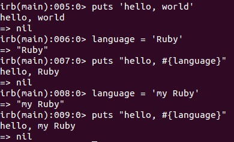
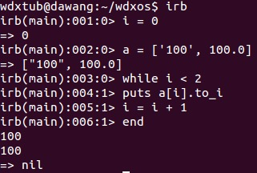

# 七周七语言 学习笔记

<!-- MarkdownTOC -->

- 1 简介
    - 选择的语言
- 2 Ruby
    - 编程模型
    - 判断
    - 鸭子类型

<!-- /MarkdownTOC -->

## 1 简介

深入探索语言本质

+ 语言的类型模型是什么？
    + 强类型/弱类型，静态类型/动态类型
    + 语言在类型模型间的权衡会产生的影响
    + 改变对问题的处理方式
    + 控制语言的运行方式
+ 语言的编程范型是什么？
    + 面向对象/函数式/过程式
    + 基于逻辑/原型语言
+ 怎样和语言交互
    + 编译/解释
    + 有/无虚拟机
+ 语言的判断结构和核心数据结构
+ 哪些核心特征让这门语言与众不同

### 选择的语言

+ Ruby: 好用好读，元编程
+ Io: 简单性和语法一致性，原型语言，消息分发机制
+ Prolog: 年事已高，威力无穷
+ Scala: 运行于 Java 虚拟机的新一代语言
+ Erlang: 函数式、并发、分布式、容错
+ Clojure: Java 虚拟机语言， Lisp 方言
+ Haskell: 纯函数式语言

## 2 Ruby

+ 脚本型、解释型、面向对象、动态类型
+ 支持封装、类继承、多态
+ 程序员编程效率提高。

使用 1.8.7 版本

    sudo apt-get install ruby1.8

输入 `irb` 测试是否安装成功(进入交互命令行)

### 编程模型

+ 过程式语言: C, Fortran, Pascal
+ 面向对象语言: C++, Java(也带有过程式语言的要素，例如 4 在 Java 中就不是对象)
+ 函数式编程语言: Scala(也加入了一些面向对象思想)
+ 基于栈的语言: PostScript, Forth
+ 基于逻辑的语言: Prolog(以规则为中心)
+ 原型语言: Io, Lua, Self(用对象而不用类来作为定义对象甚至继承的基础)

Ruby 是纯面向对象的，每个单独的数字都不例外

    > 4
    > 4.class
    > 4.methods

### 判断

Ruby 中的 true 和 false 也是一等对象(first-class object)。

使用 if 或 unless 时，可以选用单行形式(statements if condition)或者块形式(if condition, statements, end)

    puts 'This appears to be false.' unless x == 4
    puts 'This appears to be true.' if x == 4

while 和 until 同样是如此

    x = x + 1 while x < 10
    x = x - 1 until x == 1

注意，除了 nil 和 false 之外，其他值都代表着 true，0 也是 true！

逻辑运算符为 and(&&), or(||), 短路规则

### 鸭子类型

Ruby 是强类型语言，发生类型冲突时，会得到一个错误，是在运行时进行类型检查的(动态类型)

上面就是常用的鸭子类型(duck typing)，数组里的元素是两个类型，但是可以用同一个函数进行转换。压力类型并不在乎其内在类型可能是什么。

**面向对象设计思想：对接口编码，不对实现编码**(依赖反转原则 Dependency Inversion Principle, DIP 的一种实践应用)

例如，对象若有 push 和 pop 方法，就能当做栈来用，若没有，就不能当做栈来用。
