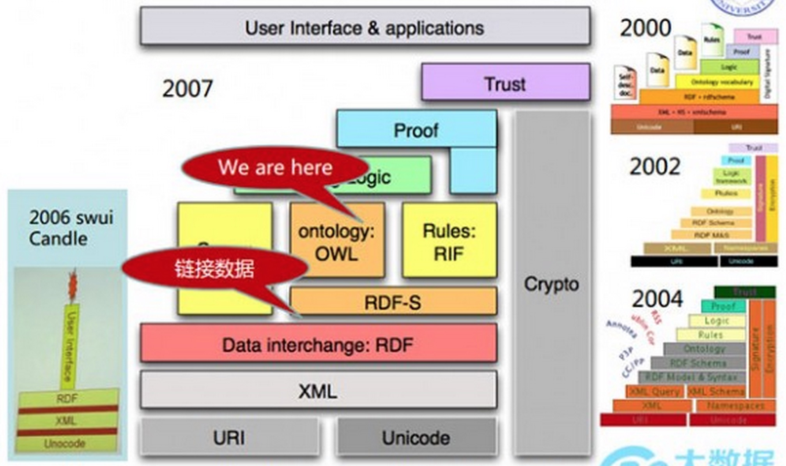
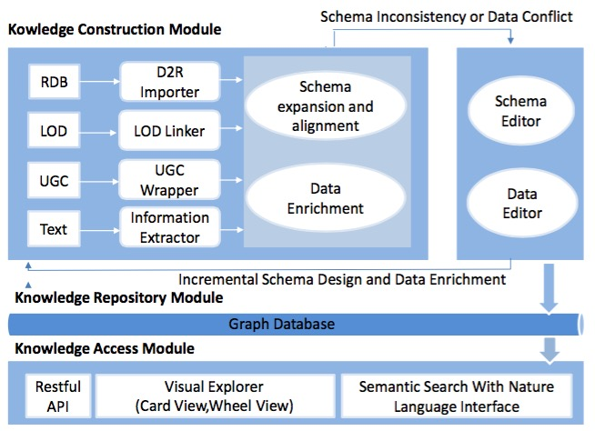
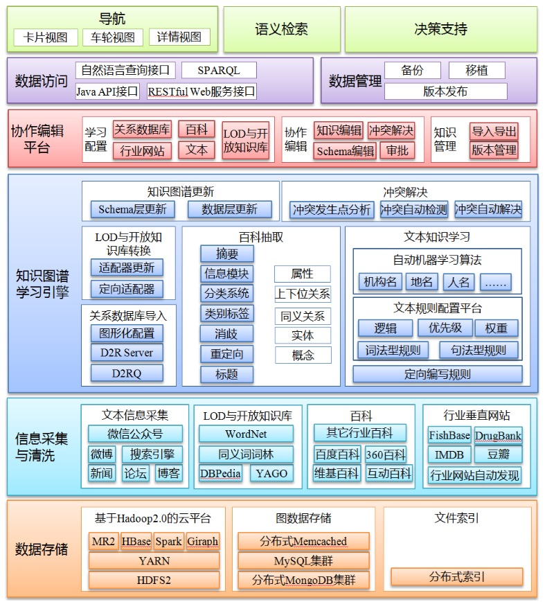
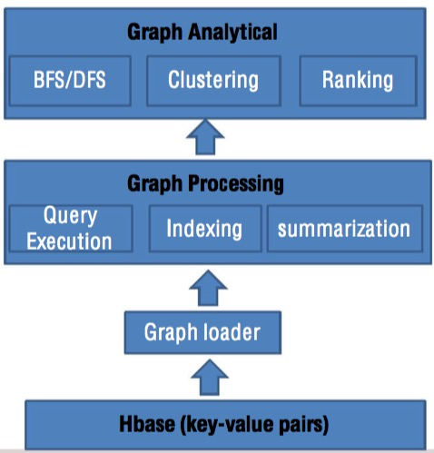
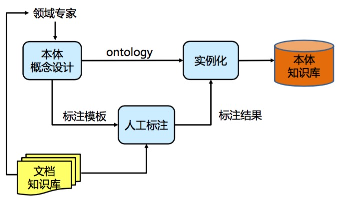
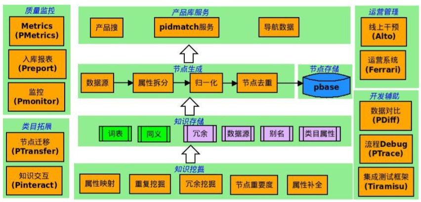

# 知识图谱设计

<!-- MarkdownTOC -->

- wkk 中的设计
- 知识图谱
- 中文知识图谱：体系、获取与服务
    - 知识体系
    - 知识获取
- 知识图谱：大数据语义链接的基石 - 李涓子
    - 概念三角形
    - 本体形式化
    - 本体的描述方法
- 垂直知识图谱构造工具与行业应用
- 王昊奋：大规模知识图谱技术
- 面向中文知识图谱构建的知识融合与验证
    - 相关工作
    - 知识融合
    - 知识验证
- 中文知识图谱 - 复旦
- 从应用角度来看知识图谱的价值和挑战
- 阿里巴巴实践
- Knowledge-Based Application Design Patterns - Google
- 论文

<!-- /MarkdownTOC -->

## wkk 中的设计

从 wiki 抓取。

根节点为空

下属各个学科，领域，然后不同的学科领域再往下细分，像树一样

在前几层(也就是比较广义的学科时)树是不允许交叉的

而进入比较细分的领域(也就是各种学科的技术开始交叉，有交叉学科的层级)不同领域的内容可以开始交叉，这时候表示的数据结构也要开始变化

像生活大爆炸里的多维象棋一样，整个知识图谱是一个多维的表示，不同层级有不同层级的基本逻辑。比方说在比较抽象的层级，这里的学科不能交叉，也有一定的差异，比方说语文数学英语之类的。在下面相对具体的层级，比方说机器学习这一层，其实可以应用到更多不同的细分领域，就可以开始互相交叉了。也就是说越具体，数据结构越复杂

在推荐的时候，就可以根据这样的结构，进行同层和跨层的检索

而用户的笔记，也就是在完善整个知识图谱，这个完善的过程，一部分自动，一部分也可以是手动(因为更加准确)，然后相当于训练边的强度，用户可以看到自己的知识架构的茁壮程度，技能点技能书的选取

也可以基于此给出具体的可操作的建议。

而新的内容也可以自动分类到不同的层级领域类别，进行统一的管理

当然，学术界和工业界都还没有做好的东西，我不会涉及，只在一个小的子集进行尝试

RDF

信息的组织一定要有一个轴，这个轴是什么，怎么去展示，很重要。现在我的做法是用hownet和ssco结合起来作为轴，加上text classification作为资料补充，以这个轴来做基于图的推荐，这里特别的地方，一个是小规模，一个是个人化。这意味着使用时需要加入自己的标注，始终觉得semi-supervised的方法才是最可行的。不过这个方法的问题在于，如果想要利用大数据，需要处理的冲突很多，但是目前时间紧迫，就只能先这样了。

当在wikipedia中输入USA时，会自动调转到Unitied States页面，所以我们可以将USA看作是United States的同义词，通过去歧义页面（DisambiguationPage）和内链锚文本（Internal Link Anchor Text）获得它们的同音异义词（又称Homonym）；

---

## 知识图谱

知识图谱是一种对人类知识的进行存储和表示的半结构化数据集。一般知识图谱的信息中心是命名实体，也叫 entity，object，对象，等等。然后常见的信息有：

+ 对象的分类信息(ontology)，例如：知乎 是一个 网站，
+ 对象的属性(attribute)，例如：知乎 的女神数有 xxx 万，
+ 对象之间的关系(relationship)， 例如：知乎 CEO 是 黄继新，
+ 对象的文本描述(description)，例如：知乎“是一个好网站，但是有些人居然在上面约来约去，这样是不合适的。尤其是只约别人不约我的话。”

根据现有学术界的进展，靠社区人工编辑形成的知识图谱（Wikipedia， Freebase），在质量，覆盖率，精准度上都远超任意一个公开的全自动生成的知识图谱（NELL，OpenIE，DeepDive）。所以我会主要依靠中文 Wiki 和百科，然后辅助定向抓取的自动生成的结果。

这部分是最花时间，也是最关键的工作。数据的清洗，不同信息源结果的合并，以及自动抓取和模板分析都有很多 dirty work 在里面。

一个命名实体想要可用，光有这个词是不够的，你还需要有：

+ 分类信息（ontology）
+ 描述（description）
+ 一些属性（attribute）
+ 和他的主要的相关对象之间的关系（relationship）

目前最大的公开知识图谱 Freebase 的达到这个要求的命名实体数是 500 万，还是英文。

有了这个知识图谱后，剩下的部分都是可以靠在已有的技术上做一些工程开发和优化可以解决的了。

**我还需要一个中文分词系统**

现在经过中国科学家们的努力，中文分词已经做的非常非常好了。对于绝大多数query，分词不再是效果的瓶颈。

所以我会直接使用现有的工具，例如中科院的 ICTCLAS，哈工大的 LTP。

他们对于我的需求基本足够。

为了更好的效果，我会外挂一些行业词库，然后自己再把分词切碎的长短语通过 entity 词表粘贴起来。这可以解决绝大多数问题。

**然后，我要对这个中文知识图谱建立索引**

建立索引的目的是为了对搜索词条（query）快速响应。有两种方法可以选择：

1，Graph Datebase，或者直接 Database。例如 Neo4j，或者直接 MySQL。这样的话就是把知识图谱当作严格的结构化信息，然后当作图，或者简单的 columns 存到 Graph DB/DB 里。

这样的好处是支持严格的结构化 query 查找，例如：

    find 苹果 ->首席执行官
    ------- 结果 ---------
    库克

但是这样要求 query 必须严格匹配，其实非常受限。这个问题叫做 semantic search，已经被学术界研究了很多年，但是并没有成熟应用。

而且，由于一般 graph db 支持的 query 结构过于复杂，导致速度很难上的去。而复杂的结构化 query 和 Magi 的需求并不太合适，所以我会选择第二种。

2，搜索引擎的反向索引，例如 Lucene，Indri。这样就是把每个 entity 的信息作为一个文档，所有的信息都待着 xml tag 放进去，然后搜索的时候按照关键词来匹配，拿到结果后再重新结构化，再和 query 做匹配。

为了支持对名字，描述，关系，类别，属性的匹配，我把它们各自封装到对应的 xml tag，或者 field 里，然后每来一个 query，我会对这几个 field 都做关键词匹配的检索。

**有了这些数据，我就可以对 query 进行在知识图谱中的搜索了**

1，先要明确的是，我不知道如何在超过一阶关系的长 query 上在保证 recall 和覆盖率的情况下做到可用级别的效果。例如：

    query：美国的总统的老婆
    转为 structured query： 美国 ->总统 ->配偶
    返回：米歇尔奥巴马

这个问题我没有解决方案，学术界没有，Google 没有，百度没有

长 query 理解的难点：

+ 从文本 query->structure query 的转化非常难，一点语言的变化就会带来新的挑战。
+ 长 query 往往对应着高阶关系，这里面的 noise 是乘数关系，每一部一点小小的失误累加起来就会使得结果完全不靠谱

而搜索是一个对精确度要求特别高的应用，如何在保证召回说得过去的情况下（例如 1%的网页 query），达到足够高的 precision？

这是学术界和工业界都没能解决的问题

2，但是，我可以做到对直接的命名实体的查询，以及一部分命名实体 + 关系的查询。

前者是：

    query：苹果公司
    返回：[苹果公司] 是 一家消费电子公司

后者是：

    query：苹果公司首席执行官
    structured：苹果公司 ->首席执行官
    返回：库克

2.a，首先解决单个命名实体的查询

这个是可行的，也是学术界工业界已经做到了的。

这个问题可以定义为 entity linking 问题，既，给定一个文本，如何找出其中的 entity，然后 match 到知识图谱中的对象，目前学术界最新的结果大概是 50-60%的 F 值

大概做法是收集足够的别名，给定一个 query 后做一次精准匹配，然后把匹配到的名称的对象拿出来，然后用上下文进行消歧。

这个任务主要有三个问题：

+ 消除歧义：苹果是水果，还是电脑？
+ 别名，（Alias，surface form）的处理：既如何做到“春哥”->李宇春的识别
+ 覆盖率：知识图谱够不够大，够不够全。

我个人感觉这应该是最先解决的问题。

surface form 和覆盖率已然要靠足够大和全的知识图谱。而目前已知的做法离自动构建超过人工编辑的知识图谱距离很远。

2.b， 然后是基于命名实体的结果之后的一阶关系查询

这个通过关键词来 hit 到知识图谱中的关系即可，对于明显的类似两个词的 query 是做得到的。

先做了命名实体匹配，然后用剩下的部分做一次对关系的几种名称的 exact match 之类的方法。离能够解决自然语言多种 variance，然后给出和关键词匹配一样级别的模糊查找，相距甚远。当然这是整个学术界工业界都尚未解决的问题。

---

## 中文知识图谱：体系、获取与服务

The Knowledge Graph is a system that understands facts about people, places and things and how these entities are all connected.

知识图谱本质上是一种语义网络。其结点代表实体(entity)或者概念(concept)，边代表实体/概念之间的各种语义关系。

### 知识体系

+ Ontology vs Knowledge Base
    + Ontology: 共享概念和的规范，涉及**概念**、**关系**和**公理**三个要素
    + Knowledge Base: 服从于 ontology 控制的知识单元的载体
    + Ontology 是蛋糕的模具，Knowledge Base 是蛋糕
+ Formal Ontology vs Lightweight Ontology
    + Formal Ontology: 大量使用公理
    + Lightweight Ontology: 不用或很少使用公理
+ 关系
    + 层级关系 Hypernym - Hyponym
        + Is-a (Kind-of)
        + Part - Whole
    + 非层级关系
        + Thematic roles 论旨角色
        + Possession 领属
        + Attribute 属性
        + Casuality 因果

**三种组织形式**

+ 层级分类法
    + Ontology(狭义)
        + 树状结构，不同层节点之间具有严格的 IsA 关系
            + Human activities -> leisure activities -> sports -> golf
        + 优点：因为概念关系单一，方便于知识推理
        + 缺点：无法表示概念关系的多样性
    + Taxonomy
        + 树状结构，上下位节点之间并非严格的 IsA 关系，而是 Hypernym - Hyponym 关系
            + Places -> Milky Way Galaxy -> Solar Systems -> sol -> Inner Planets -> Earth -> North America -> United States -> California
        + 优点：可以表示比较丰富的概念关系
        + 缺点：给推理带来困难，无法避免概念冗余
+ 标签分类法
    + Folksonomy
        + 网络用户自发性定义的平面的、费层级的标签分类
        + 优点：灵活，可以表达更为丰富的概念关系
        + 缺点
            + 缺乏层次性，难以揭示复杂的关系
            + 自定义的标签缺乏语义精确性，标签缺乏组织与关联
            + 给推理带来很大的困难
    + 目前网络知识资源(Wikipedia、百度百科、互动百科等)多是采用 Taxonomy 与 Folksonomy 相结合的组织形式，以 Taxonomy 为主
    + 存在的问题
        + Folksonomy 标签不能覆盖所有的关系(开放分类标签 & Infobox 属性标签)
        + 这些开放式类别标签存在冗余、不规范的问题，标签之间也缺乏关联
        + 不同的只是资源采用不同的 Taxonomy
        + 类别属性定义不统一
    + 解决方案：Ontology Matching
        + 建立体系间的 Alignment
        + 评测：Ontology Alignment Evaluation Initiative

### 知识获取

+ 文本信息结构
    + 结构化数据(Infobox)：置信度高、规模小、缺乏个性化的属性信息
    + 半结构化数据：置信度较高、规模较大、个性化的信息、形式多样、含有噪声
    + 纯文本：置信度低、复杂多样、规模大
+ 抽取方法
    + 结构化与半结构化文本信息(利用网页信息)
        + 信息块的识别(Record Identification)
        + 模板的学习(Pattern Learning)
        + 属性值的抽取(Attribute Value Extraction)
    + 相对于工业界，学术界更加侧重于从纯文本中抽取实体知识

---

## 知识图谱：大数据语义链接的基石 - 李涓子

**知识图谱基础**

+ DBpedia
    + 250 概念, 4M 实例, 6000 属性, 500M 三元组, 在线更新
+ yago
    + 350K 概念, 10M 实例, 100 属性, 120M 三元组
+ XLORE
    + 850K 概念, 8M 实例, 70K 属性
+ Freebase
    + 15K 概念, 40M 实例, 4000 属性, 1B 三元组, Google KB 核心
+ Google KG
    + 15K 概念, 600M 实例, 20B 三元组
+ BabelNet
    + 50M 义项, 50+ 种语言, 262M 三元组
+ WordNet
    + 7 种欧洲语言, 跨语言链接

**知识图谱类型**

+ 领域无关知识图谱
    + 人工构建
        + ResearchCyc, www.cyc.com/platform/researchcyc
        + WordNet, wordnet.princeton.edu
    + 基于维基百科
        + DBPedia, dbpedia.org
        + YAGO, yago-knowledge.org
        + Freebase, freebase.com
        + WikiTaxonomy
        + BabelNet, babelnet.org
    + 开放知识抽取
        + KnowItAll, openie.cs.washington.edu
        + NELL, rtw.ml.cmu.edu
        + Probase, research.microsoft.com/en-us/projects/probase/
    + 中文知识图谱
        + 百度知心
        + 搜狗知立方
+ 特定领域知识图谱
    + FOAF, Geonames, Linked Movie Database, etc
+ 跨语言知识图谱
    + DBPedia, Yago, Freebase, XLORE, etc

**万维网信息描述语言塔**

### 概念三角形

哲学的本体定义: Ontology is the philosohpical study of the nature of **being, becoming, existence** or **reality**, as well as the **basic categories** of being and their relations.

计算机领域本体定义: An **ontology** is a formal, explicit specification of a shared conceptualization - Gruber 1993

+ **Conceptualization**: **an abstract model** of phenomena in the world by having identified the relevant concepts of those phenomena.
+ **Explicit**: the type of concepts used, and the constraints on their use are explicitly defined.
+ **Formal**: the fact that the ontology should be machine readable.
+ **Shared**: ontology should capture consensual knowledge accepted by the communities.

### 本体形式化

五元组表示 O = {C, R, F, A, I}

+ **C** - concepts
    + 概念集合，通常以 Taxonomy 形式组织
    + 球星，球迷
+ **R** - relations
    + 描述概念或者实例之间语义关系的集合
    + subClassOf, birthplace
+ **F** - functions
    + 一组特殊的关系，关系中第 n 个元素的值由其他 n-1 个元素的值确定
    + Price-of-a-used-car 由 the car-model, manufacturing data 和 kilometers 确定
+ **A** - axioms
    + 公理
    + 如果 A 是 B 的子女，B 是 C 的子女，则 A 是 C 的子孙
+ **I** - instances
    + 描述具体的**个体**
    + 如：Peter 是概念**学生**的实例

### 本体的描述方法

+ 资源描述框架 RDF
    + Resource Description Framework
+ RDF 数据模式
    + **资源 Resource**
        + 使用 **URI** 唯一标示一个资源
        + 一个资源通常标示一个事物(Thing)
    + **属性 Property**
        + 一种特殊类型的资源，用以描述资源与资源间的关系
    + **语句 Statement**
        + 由 3 种资源组成的三元组(Triple)
        + 主语 rdf:subject，谓语 rdf:predicate 以及宾语 rdf:object

**本体的简化形式**

O = {C, I, T, P}

+ **C** - concepts
    + 描述领域或任务中的**抽象概念**，通常以 Taxonomy 形式组织
    + 如描述世界知识的本体中，**学生**和**老师**是两个概念
+ **I** - instances
    + 描述具体的**实例**
    + **学生Peter**是概念学生的实例
+ **T** - ISA
    + 概念与概念之间、实例与概念之间的关系
    + `subClassOf关系`和`instanceOf关系`
+ **P** - properties
    + 本体中用于描述实例信息的**其他语义关系**
    + 如: **instance-attribute-value**(AVP)

**总结**

+ 知识图谱实现对客观世界从字符串描述到结构化语义描述，是对客观世界的知识映射(mapping world knowledge)
+ 本体可以作为知识图谱表示的概念模型和逻辑基础
+ 知识图谱可以描述不同层次和粒度的概念抽象
+ 知识图谱可以作为互联网资源组织的基础

---

## 垂直知识图谱构造工具与行业应用

_阮彤，华东理工大学_

+ 通用知识图谱
    + [ssco](http://ssco.zhishimofang.com)
        + **分类极有意义，可用**
    + [zhishi.me](http://http://zhishi.apexlab.org/)
        + 质量较差，暂时可能很难用上
    + [知网](http://www.keenage.com/zhiwang/c_zhiwang.html)
        + 参考学习

**知识图谱的技术优势**

+ 渐进式数据模式设计
    + 初始设计的时候，很难清楚所有的概念，而知识图谱的动态可扩充性以及“无模式”特性使得用户很容易增加或者改进模式
+ 数据集成更轻松
    + 本体的语义互操作特性以及“链接数据”原则，使得来自不同供应商的数据集成更为方便
+ 现有标准支持
    + 有 RDF(S), OWL, SPARQL 等标准，可以逐渐要求内容供应商支持
+ 语义搜索
    + 用户可以查询具有某类特征的某类实体，比起基于关键词的搜索，更为精准

**框架**

---

## 王昊奋：大规模知识图谱技术

王昊奋，华东理工大学讲师，上海交通大学计算机应用专业博士，对语义搜索、图数据库以及Web挖掘与信息抽取有浓厚的兴趣。在博士就读期间发表了30余篇国际顶级会议和期刊论文，长期在WWW、ISWC等顶级会议担任程序委员会委员。作为Apex数据与知识管理实验室语义组负责人，他主持并参与了多项相关项目的研发，长期与IBM、百度等知名IT企业进行合作，在知识图谱相关的研究领域积累了丰富的经验。

实体对齐（ObjectAlignment）：旨在发现具有不同标识实体但却代表真实世界中同一对象的那些实体，并将这些实体归并为一个具有全局唯一标识的实体对象添加到知识图谱中。虽然实体对齐在数据库领域被广泛研究，但面对如此多异构数据源上的Web规模的实体对齐，这还是第一次尝试，目前多采用聚类的方法。聚类的关键在于定义合适的相似度度量。

这些相似度度量遵循如下观察：具有相同描述的实体可能代表同一实体（字符相似）；具有相同属性-值的实体可能代表相同对象（属性相似）；具有相同邻居的实体可能指向同一个对象（结构相似）。

另外利用来自如LOD (linked open data)中已有的人工对齐标注数据（使用owl:sameAs关联两个实体）可以作为训练数据学习发现更多相同的实体对。无论何种自动化方法都无法保证100%的准确率，这些方法的产出结果将作为候选供人工进一步审核和过滤。

知识图谱schema构建：在之前介绍中，大部分篇幅均在介绍知识图谱中数据层（Data Level）的构建，没有涉及模式层（Schema Level）。事实上，模式是对知识的提炼，遵循预先给定的schema有助于知识的标准化，更利于知识查询等后续处理。

为知识图谱构建schema相当于为其建立本体（Ontology）。最基本的本体包括概念、概念层次、属性、属性值类型、关系、关系定义域（Domain）概念集以及关系值域（Range）概念集。在此基础上，我们可以额外添加规则（Rules）或公理（Axioms）来表示模式层更复杂的约束关系。面对如此庞大且领域无关的知识库，即使是构建最基本的本体，也是非常有挑战的。

目前大部分知识图谱建立的方法是自顶向下（Top-Down）和自底向上（Bottom-Up）相结合的方式。自顶向下的方式是指通过本体编辑器（Ontology Editor）预先构建本体。当然这里的本体构建不是从无到有的过程，而是依赖于从百科类和结构化数据得到的高质量知识中所提取的模式信息。

图谱模式定义了Domain（领域），Type（类别）和Topic（主题，即实体）。每个Domain有若干Types，每个Type包含多个Topics且和多个Properties关联，这些Properties规定了属于当前Type的那些Topics需要包含的属性和关系。另一方面，自底向上的方式则通过上面介绍的各种抽取技术，特别是通过搜索日志和Web Table抽取发现的类别、属性和关系，并将这些置信度高的模式合并到知识图谱中。自顶向下的方法有利于抽取新的实例，保证抽取质量，而自底向上的方法则能发现新的模式。

当融合来自不同数据源构成知识图谱时，有一些实体会同时属于两个互斥的类别（如男女）或某个实体所对应的一个Property （如性别）对应多个值。这样就会出现不一致性。由于不一致性的检测要面对大规模的实体及相关事实，纯手工的方法将不再可行。一个简单有效的方法充分考虑数据源的可靠性以及不同信息在各个数据源中出现的频度等因素来决定最终选用哪个类别或哪个属性值。

通过上述介绍可以看出：

1. 目前知识图谱还处于初期阶段；
2. 人工干预很重要；
3. 结构化数据在知识图谱的构建中起到决定性作用；
4. 各大搜索引擎公司为了保证知识图谱的质量多半采用成熟的算法；
5. 知识卡片的给出相对比较谨慎；
6. 更复杂的自然语言查询将崭露头角（如Google的蜂鸟算法）。

---

## 面向中文知识图谱构建的知识融合与验证

_lesunle@163.com, xianpei@nfs.iscas.ac.cn_

+ NLP 和 AI 的终极目标之一是构建比肩人类的文本阅读和理解系统
+ 缺乏支撑计算机智能推理和决策的知识库一直是构建上述系统的瓶颈之一
+ **目标：逐步构建可支撑上述目标的中文知识图谱**

### 相关工作

**传统知识库**

+ 基于人工编写方式，构建了一系列的中小规模中文知识库
    + 知网(HowNet)[董振东 和 董强, 1999]
    + 《同义词词林》[梅家驹等, 1996]
    + 概念层次网络(HNC)[黄曾阳, 1997]
+ 特点
    + 规模相对较小
    + 建模的知识范围特定
    + 不同知识库构建的目的不一样，因此使用不同的语义描述元数据，覆盖不同类别的知识

**协同知识库**

+ 基于 Web 2.0 的方式，各个领域都有丰富的 Web 2.0 知识站点的创立
    + 通用知识：百度百科、维基百科、互动百科
    + 书籍音乐电影：豆瓣
    + 商品：淘宝
    + 餐馆：大众点评
    + 医学：丁香园
+ 由于 Web 的去中心化结构，这些知识以分散、异构、自治的形式存在，而不是一个统一、一致的知识整体

**特点总结**

+ 分散：知识独立自治的存在于多个源中
+ 异构：不同知识资源使用不同的结构和元数据
+ 冗余：各个知识源中的知识具有一定的重叠
+ 噪音：Web 2.0 方式引入大量错误和噪音
+ 不确定：通常需要集成不确定的信息抽取系统结果
+ 非完备：知识的长尾性 -> 仅仅覆盖特定领域的高频知识，大部分是常识知识库
+ 中文知识缺乏：现在已经有大规模的英文知识图谱，但是大规模中文知识图谱的工作相对缺乏

**出发点**

如何从当前的这些知识出发，构建准确、高覆盖、一致的大规模中文知识图谱？

+ 策略一：融合
    + 充分利用现有知识库，融合这些分散、冗余和异构的知识，作为构建中文知识图谱的出发点
+ 策略二：验证
    + 对新加入知识图谱的知识(如信息抽取系统的结果，众包标注)进行验证，确保新知识与知识图谱的一致性，持续更新中文知识图谱

### 知识融合

定义(Wikipedia): The merging of information from **heterogeneous** sources with differing **conceptual**, **contextual** and **typographical** representations

+ 数据层融合
    + Record Linkage / Entity Linking / Entity Resolution
    + 百度百科：中国 <--> Wikipedia: China <--> 互动百科：中国
+ 语义描述层融合
    + Schema Mapping
    + 百度百科：科学家类别 <--> Wikipedia: Scientist Category

**数据层融合关键技术 - 实体链接**

+ 等同性(Equality)判断
    + 给定不同数据源中的实体，判断其是否指向同一个真实世界实体
+ 基于等同性判断，我们可以连接不同知识源中的等同知识，从而将多个分散的知识源连接成为一个整体
    + Linked Data
+ 方法
    + 基于实体 - 提及模型的实体链接
        + 不同实体的上下文词分布通常有极大的差异
    + 基于篇章主题的链接
        + 文章中的实体通常与文本主题相关，因此这些实体相互之间语义相关
        + 基于图的协同推断
        + 协同推导：通过将证据在图上的依存结构上传递来协同增强证据直至收敛
    + 融合实体知识域篇章主题的链接
        + 建模文本主题：假设每一篇文本都有 N 个内在主题，每一个主题是实体的多项式分布

**描述层知识融合(Schema Mapping)**

+ 我们有一个集合的知识源，每个知识源使用不同的分类体系和属性体系
+ 需要将这些 Schema(分类体系和属性体系)统一为一个全局的 schema
+ 难点
    + 属性体系并非简单的一对一关系
    + 需要综合利用多种类别的信息
        + 属性的语义信息
        + 属性的值分布信息
        + 属性的联合分布
+ 解决方案
    + 建立一个全局的 Schema
    + 利用一个集合的 Base learners，将不同知识源中的 schema 与全局 Schema 进行映射
    + 使用 Meta-Leaner 来综合利用 Base learner 的分类结果并利用属性的联合分布信息，从而得到最终的 Schema mapping 全局结果

### 知识验证

+ 知识图谱构建不是一个静态的过程，需要
    + 计时更新动态知识
    + 加入新知识
+ 需要判断新知识是否正确，与已有知识是否一致

**知识验证证据**

+ 权威度：权威度高的信息源更有可能出现正确的答案
+ 冗余度：正确的答案更有可能出现
+ 多样性：正确的答案会以不同的方式表达
+ 一致性：正确的答案应当与其他知识相容无冲突

**知识验证的统计模型**

+ 计算新知识与现有知识相容的可能性概率
    + 马尔科夫逻辑网络
        + 将知识和知识之间的约束建模为逻辑规则
        + 对这些规则赋予权重表示违反该条规则的代价
    + 基于 MLN 的知识验证
        + 所有陈述按照逻辑规则相互链接
        + 一条知识域当前知识图谱的相容性取决于其违反逻辑规则的多少和重要性

---

## 中文知识图谱 - 复旦

_shawyh@fudan.edu.cn, gdm.fudan.edu.cn_

+ What is knowledge graph?
    + Knowledge graph contains entities/concepts as vertices and semantic relationships as edges
+ What makes knowledge graph different?
    + Ontology
        + Domain dependent
        + Small scale
    + Semantic network
        + Focus on concepts instead of entities
    + Knowledge graph
        + Large scale
        + Cover entities and concepts
        + Cover different semantic relationships

**Cloud based Graph DB engine**

A graph db system based on Hbase, support big knowledge graph data

---

## 从应用角度来看知识图谱的价值和挑战

+ 知识图谱**旨在描述真实世界中存在的各种实体或概念及其关系**，一般用三元组表示
+ 知识图谱亦可呗看做是一张巨大的图，节点表示实体或概念，边则由属性或关系构成

**人工参与的本体知识库构建**

---

## 阿里巴巴实践

---

## Knowledge-Based Application Design Patterns - Google

Freebase, Google Refine, Schema.org, Knowledge Graph

**Freebase Knowledge Graph**

+ www.freebase.com
+ Open, crowd-sourced, knowledge graph
+ 23M+ topics, 2k+ commons types
+ RESTful APIs
+ Creative Commons Attribution License
+ Data dumps
+ A source for Google's Knowledge Graph

+ Discovery Patterns
    + **Turning Strings into things**
+ Visualization Patterns
    + Trees, Maps, Timelines, Graphs, Bubble Charts
    + [Thinkbase](http://thinkbase.cs.auckland.ac.nz)

## 论文

+ http://cpfd.cnki.com.cn/Article/CPFDTOTAL-LNSL201008001095.htm
+ http://www.cqvip.com/qk/93202x/200803/27479992.html
+ [In Papers]Building, Maintaining, and Using Knowledge Baese: A Report from the Trenches
+ [In papers]国内知识图谱应用研究综述
+ Xing Niu, Xinruo Sun, Haofen Wang, Shu Rong, Guilin Qi and Yong Yu, Zhishi.me - Weaving Chinese Linking Open Data, Semantic Web In-Use track, in Proc. of The 10th International Semantic Web Conference (ISWC 2011), October 23, 2011, Bonn, Germany.

